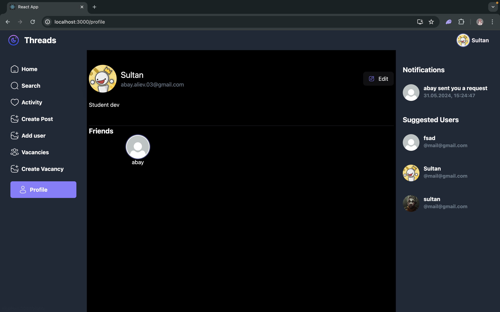

# final blockhain project

## Usage
### Running frontend
```
cd frontend
npm install
npm run dev
```

### Running backend
```
cd backend
npm install
npm run dev
```

## Example of running
### Run process
two console where in first is front and in second is back


### Profile page



### Register and Login page


## License
Copyright (c) cowbuno, Blisstod, SoftDev-Abay
